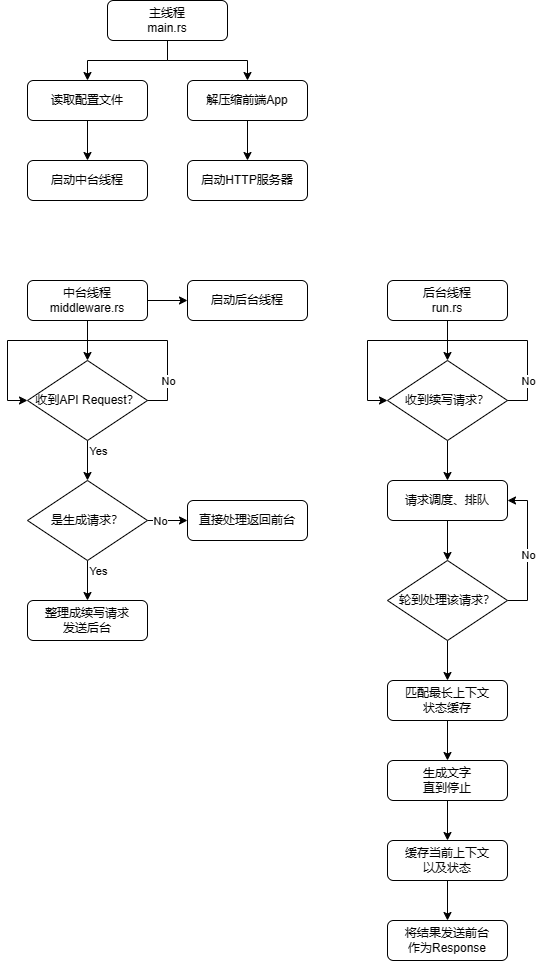

# 代码导读

`Ai00`是一个基于`Axum`的、为`RWKV`模型提供本地推理服务的服务器。这篇文章是它的主要逻辑、代码结构的说明。

## 名词解释
- token: 词元，模型能够处理的、被数字化的最小语言单元。在`RWKV`的词表中，一个`token`通常是一个单词或中文里的一个单字。每个`token`都有它的数字编号，模型的输入输出就是这些数字编号，而不是字符串。`RWKV`的词表里一共有65536个`token`。

## `Ai00`都做了些甚么
`Ai00`是一个LLM推理服务器。它通过HTTP协议实现了一套API，其他程序通过这套API可以令`Ai00`为它提供的上下文生成一段文字。

逻辑上来说，`Ai00`可以分为前台、中台、后台三个部分：
- 前台: `Axum`服务器，部署着公开的API。那些和模型推理有关的API接受请求后发送给中台。部分和模型推理无关的API（比如直接访问文件系统的API）直接处理并返回。
- 中台: 接受前台API的请求，将请求分拣成模型加载/卸载、模型信息请求、生成文字请求三大类。
  - 中台在接受到模型加载/卸载请求的时候，会创建、销毁后台；
  - 中台在接受生成文字请求的时候，会将各种生成任务整理成统一的续写请求，发送后台处理。
- 后台: 后台拥有着一个模型和一个状态缓存池，而且它只接受中台发来的续写请求。在接受到续写请求后，后台会完成续写，把结果直接发送回前台。

| 模块 | 代码位置                           | 说明                                                                              |
| ---- | ---------------------------------- | --------------------------------------------------------------------------------- |
| 前台 | [api/](src/api/)                   | 与OpenAI兼容的API在[api/oai](src/api/oai/)里面。                                  |
| 中台 | [middleware.rs](src/middleware.rs) | 入口是`model_route`函数。这个函数运行在一个单独的线程里，时刻监听前台发来的消息。 |
| 后台 | [run.rs](src/run.rs)               | 入口是`run`函数。这个函数持有模型、状态缓存等，也运行在一个单独的线程里。         |



## `Ai00`的底层依赖

`Ai00`最重要的依赖是[`web-rwkv`](https://github.com/cryscan/web-rwkv)，它提供了tokenization、载入模型、模型推理的功能，这是整个`Ai00`后端的基础。这里简单介绍以下`web-rwkv`本身提供的功能。

`RWKV`是一个RNN模型。RNN模型在生成文字的时候，接受一串`token`作为**输入**，以及一个蕴含了输入之前所有上下文信息的**状态**，产生一个**概率分布**来预测输入之后下一个词的概率，并同时更新状态。

```rust
let tokens = vec![ModelInput {
  tokens: vec![33155, 45],  // "Hello,"
  ty: OutputType::Last,
}];
let logits: Vec<ModelOutput> = model.run(&mut tokens, &state).await?;
assert_eq!(tokens[0].len(), 0); // 输入已被消耗，`tokens`里的内容被清空

// 返回的`logits`里面包含了预测的概率分布`x: Vec<f32>`，是一个长度为65536的数组
match logits[0] {
  ModelOutput::Last(x) => assert_eq!(x.len(), 65536),
  _ => unreachable!(),
}
```

上面这个函数就是`web-rwkv`提供的最核心的功能了。我们只要提供了`state`对象和输入文本`tokens`，就帮我们预测下一个词的概率`logits`同时更新`state`的内容。除此之外的琐事`web-rwkv`是不会关心的：比如如何管理多个对话上下文的`state`、如何从输出的概率分布里选出一个词（这叫**采样**）等等，都需要我们（也就是`Ai00`这边）来完成。

> Notes: 这里有人会注意到`tokens`是一个可变引用，`state`是不可变引用。而实际上这个函数执行一次不一定直接返回最后的预测概率，它是每次会“消耗”掉一定数量的输入，如果`tokens`被消耗完了，才会输出概率，否则输出的是`None`。被消耗掉的输入会被从`tokens`中移除，这也是为什么`tokens`是可变引用。而`state`虽然是不可变引用，但其在的GPU显存里的内容是**会被修改**的，只是我们无法在CPU侧体现出它的可变性。

## `Ai00`的前台都定义了哪些API？

如果想了解`Ai00`支持哪些API，可以看[api/](src/api/)里面的代码。这里面一个文件定义了一组相关的API。我们拿[chat](src/api/oai/chat.rs)这个文件举例。先在文件的最后，找到这么一个public函数：

```rust
/// `/api/oai/chat/completions`, `/api/oai/v1/chat/completions`.
pub async fn chat_completions(
    state: State<ThreadState>,
    Json(request): Json<ChatRequest>,
) -> Response {
    match request.stream {
        true => respond_stream(state, Json(request)).await.into_response(),
        false => respond_one(state, Json(request)).await.into_response(),
    }
}
```

看到上面的注释我们了解到这个函数在`Axum`服务器接收到来自`/api/oai/chat/completions`或者`/api/oai/v1/chat/completions`的请求时会被调用。

那么这个端口能接收的合法的请求结构是什么呢？答案是，只要发来的内容是可以被反序列化成`ChatRequest`这个结构的`JSON`就行。我们看下`ChatRequest`的定义，就在文件上半部分：

```rust
#[derive(Debug, Deserialize)]
#[serde(default)]
pub struct ChatRequest {
    messages: Array<ChatRecord>,
    names: HashMap<Role, String>,
    max_tokens: usize,
    stop: Array<String>,
    stream: bool,
    #[serde(alias = "logit_bias")]
    bias: HashMap<u16, f32>,
    #[serde(flatten)]
    sampler: SamplerParams,
}
```

从中我们可以看出这个API接收的格式是：
- `messages`: 一个`ChatRecord`的`Array`；
- `names`: 一个`Role`到字符串的表；
- `max_tokens`: 一个数字，表示生成的最大长度；
- `stop`: 一个停止词的`Array`，当生成的文字含有其中任何一个时，停止生成；
- `stream`: 一个`bool`，表示是否启用流式生成；
- `bias`: 注意这个`#[serde(alias = "logit_bias")]`属性，表示它在`JSON`里还可以叫`logit_bias`，表示用户自定义的输出概率的偏置；
- `sampler`: 采样器参数。这里的`#[serde(flatten)]`属性，表示`SamplerParams`结构里的内容在`JSON`里应直接出现在`ChatRequest`下，而不是嵌套一层`SamplerParams`对象。

另外，最开始的`#[serde(default)]`属性表示在（反）序列化`JSON`成`ChatRequest`对象的时候，如果发现里面缺东西了，用`ChatRequest`类型的默认值补上。

> 关于对象是按什么规则（反）序列化的，可以参考[`serde`的文档](https://serde.rs/)。

> `Array`是什么？它是我自己包装的一个类型，使得`Array<T>`可以同时从`null`，`T`, `[T]`这三个`JSON`类型被序列化。如果直接用`Vec<T>`，那就只能接受`[T]`了（悲）。

所以一个合法的API输入可以是：
```json
{
    "messages": [
        {
            "role": "user",
            "content": "Hi!"
        },
        {
            "role": "assistant",
            "content": "Hello, I am your AI assistant. If you have any questions or instructions, please let me know!"
        },
        {
            "role": "user",
            "content": "How are you doing?"
        }
    ],
    "max_tokens": 1000,
    "temperature": 1,
    "top_p": 0.5,
    "presence_penalty": 0.3,
    "frequency_penalty": 0.3,
    "penalty_decay": 0.9982686325973925,
    "stop": [
        "\nUser:",
        "User:"
    ],
    "stream": true,
    "names": {
        "user": "User",
        "assistant": "Assistant"
    }
}
```

其中`temperature`、`top_p`、`presence_penalty`、`frequency_penalty`、`penalty_decay`都是`SamplerParams`里的内容，直接被flatten到这一层了。

我们进一步来看一下`SamplerParams`这个结构。它定义了一个采样器的配置：
```rust
#[derive(Debug, Clone, Deserialize)]
#[serde(untagged)]
pub enum SamplerParams {
    Nucleus(NucleusParams),
    Mirostat(MirostatParams),
}
```

我们可以看到它是个`enum`（类似于`c++`里的`variant`），有两种可能的类型`nucleus`和`mirostat`（这些类型叫做`enum`的variant）。这就是说，它要么是一个`nucleus`采样器，要么是一个`mirostat`采样器。那他在被从JSON反序列化成`SamplerParams`对象的时候是怎么决定它的类型的呢？

其实一个`enum`有好多种（反）序列化方式（因为其他常见的语言都没有`enum`这种coproduct）。在实现层面，我们可以把一个`enum`当成tagged union，用一个tag区分其类型。这里我们标注`#[serde(untagged)]`，表示我们不在`JSON`里指明它的tag，而是从上到下依次匹配，如果有一个variant被匹配上，那就是它了。我们分别看看这两个variant里面都有什么：

```rust
#[derive(Debug, Clone, Derivative, Serialize, Deserialize)]
#[derivative(Default)]
pub struct NucleusParams {
    #[derivative(Default(value = "1.0"))]
    pub top_p: f32,
    #[derivative(Default(value = "1.0"))]
    pub temperature: f32,
    #[derivative(Default(value = "0.0"))]
    pub presence_penalty: f32,
    #[derivative(Default(value = "0.0"))]
    pub frequency_penalty: f32,
    #[derivative(Default(value = "1.0"))]
    #[serde(default = "default_penalty_decay")]
    pub penalty_decay: f32,
}

#[derive(Debug, Clone, Derivative, Serialize, Deserialize)]
#[derivative(Default)]
pub struct MirostatParams {
    #[derivative(Default(value = "3.0"))]
    pub tau: f32,
    #[derivative(Default(value = "0.1"))]
    #[serde(alias = "learning_rate")]
    pub rate: f32,
    #[derivative(Default(value = "128"))]
    #[serde(default = "default_threshold")]
    pub threshold: usize,
}
```

显而易见，如果我们接收的`JSON`里含有`temperature`、`top_p`、`presence_penalty`、`frequency_penalty`，程序会自动匹配`nucleus`类型；如果有`tau`、`rate`或`learning_rate`字段，会匹配`mirostat`类型。

> 关于更多`enum`（反）序列化的方式，参见[`enum`的表示](https://serde.rs/enum-representations.html)。

哦，还有一件事。你可能注意到`chat_completions`还有一个参数`State(ThreadState(sender)): State<ThreadState>`。其实这就是给中台发送请求的一个channel。我们这个函数的目的就是把收到的`ChatRequest`对象通过这个channel发送给中台。

从这里开始，你应该就已经能通过代码了解到所有`Ai00`支持的API了。方法总结起来就是：
1. 打开一个[api/](src/api/)下的源码文件；
2. 找到带有API注释的public函数，这就是API接收器；
3. 研究它的参数的结构，对照[`serde`的文档](https://serde.rs/)得到对应的API。