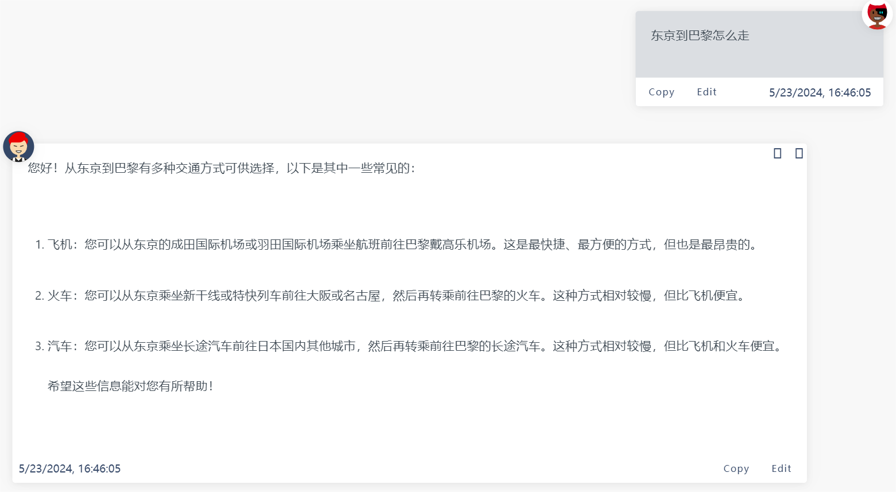
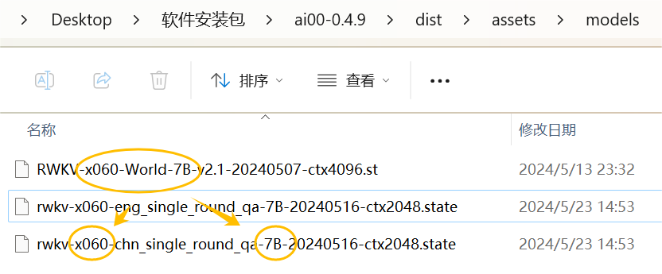
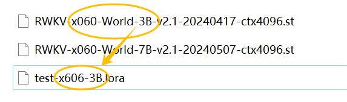
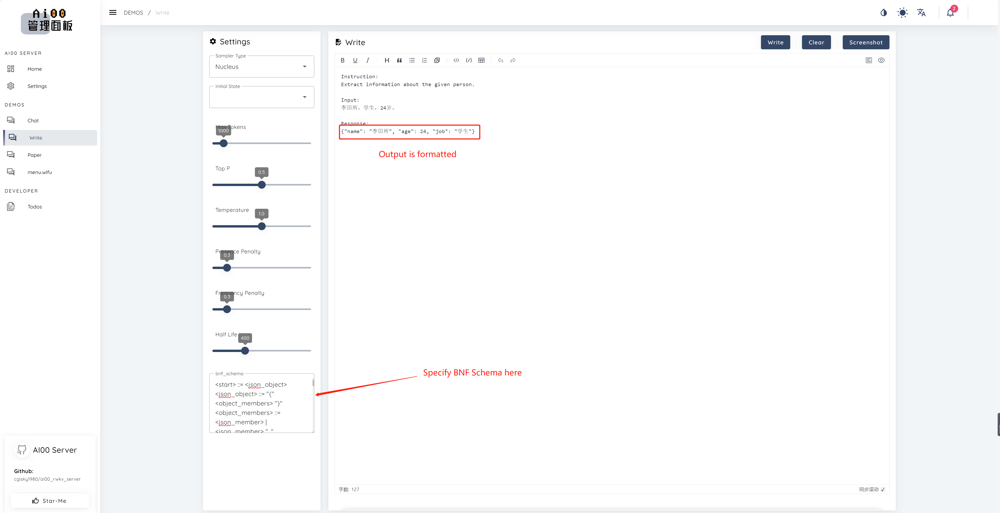
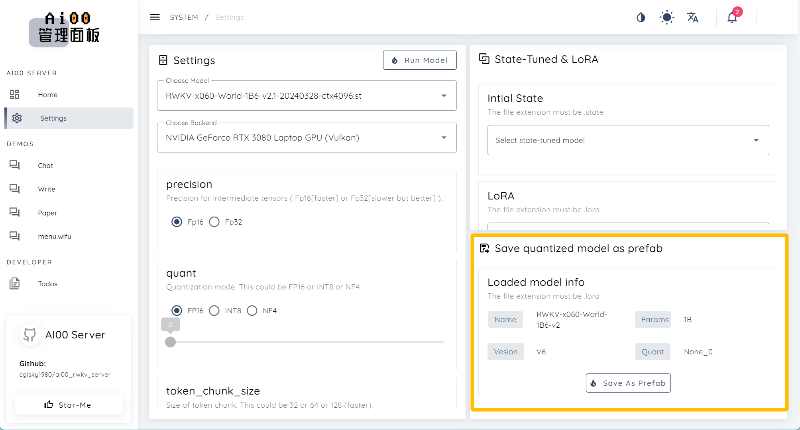

除了驱动 RWKV 模型进行对话、续写之外，Ai00 还有许多进阶功能。

你可以在 Ai00 发布新版本的时候回到本页面，以查看 Ai00 的最新功能。

## 挂载 State 文件 [版本 0.4.9]

挂载 State 文件可以强化模型在某一类任务的表现。以一个强化单轮问答 + emoji 的 State 为例，同样都是“东京到巴黎怎么走”这个问题，模型在挂载该 State 前后的回答画风完全不同：

不挂载 State 文件：



挂载“强化单轮中文对话 + Emoji ”的 State 文件后：


### 下载 State 文件

Ai00 Server 目前仅支持 `.state` 后缀的 State 文件，可以从 [HF 仓库](https://huggingface.co/cgisky/ai00_rwkv_x060/tree/main)下载 `.state` 文件。

如果你无法访问上面的网站，请访问 [HF 镜像站](https://hf-mirror.com/cgisky/ai00_rwkv_x060/tree/main)。

### 如何挂载 State ？

在 `Config.toml` 配置文件中修改关于挂载 State 的参数：

```
# [[state]] # 是否挂载 state
# id = "fd7a60ed-7807-449f-8256-bccae3246222"   #  state 文件的 UUID，不指定则随机分配 
# name = "x060-3B" # 是否为此 state 文件命名（可选项）
# path = "rwkv-x060-chn_single_round_qa-3B-20240505-ctx1024.state" # state 文件的路径
```
要启用 State 挂载功能，请移除 `#` 注释符号，并修改对应的参数。参考如下：

```
[[state]] # 是否挂载 state
# id = "fd7a60ed-7807-449f-8256-bccae3246222"   # 非开发环境一般不指定 UUID，可保留 `#` 注释符
name = "x060-7B-Chinese"  # 为此 state 文件命名为“x060-7B-Chinese”
path = "rwkv-x060-chn_single_round_qa-7B-20240516-ctx2048.state" # state 文件的名称，存放在 `model` 文件夹
```

### 挂载 State 注意事项

注意：挂载 state 文件时，必须使用与 State 文件参数一致的基底 RWKV 模型。

举个例子：这个 State 文件是基于 `RWKV-6-World-7B` 模型微调而来，那么你在 Ai00 中必须启动 `RWKV-6-World-7B` 模型，挂载的 State 文件才会生效。



> 截至 Ai00 0.5.0 版本，支持在 WebUI-聊天模式右上方动态切换 State，但不支持同时挂载多个 State 。
>
> 

---
## 挂载 LoRA 模型 [版本 0.4.9]

挂载 LoRA 模型和 State 的效果相似，也可以增强模型在某类任务上的表现。

### 如何挂载 LoRA 模型 ？

可以在 `Config.toml` 文件配置中修改挂载 LoRA 模型的参数：
```
# [[lora]] # 是否默认启用 LoRA 
# alpha = 192
# path = "assets/models/rwkv-x060-3b.lora" # LoRA 文件的路径
```
要启用 LoRA 挂载功能，请移除 `#` 注释符号，并修改对应的参数。参考如下：

```
[[lora]] # 默认启用 LoRA 
# alpha = 192
path = "assets/models/rwkv-x060-3b.lora" # LoRA 文件的路径
```

### 挂载 LoRA 模型注意事项

与挂载 State 相似，挂载 LoRA 文件时，必须使用与 LoRA 模型参数一致的基底 RWKV 模型。

举个例子：这个 LoRA 文件是基于 `RWKV-6-World-3B` 模型微调而来，那么你在 Ai00 中必须启动 `RWKV-6-World-3B` 模型，挂载的 LoRA 模型才会生效。



> 截至 Ai00 0.5.0 版本，支持在 WebUI 中同时加载多个 LoRA ，但不支持在 WebUI 中动态切换 LoRA。
> 
> 这意味着想要取消 LoRA ，必须重启 Ai00 服务。

---
## BNF (Backus-Naur Form) [版本 0.4.9]

BNF 可以强制模型以您想要的格式输出（例如，JSON、带有指定字段的 markdown）。

以下是一个 JSON 的 BNF 示例，其中包含字段 name 和 age ：

```
<start> ::= <json_object>
<json_object> ::= "{" <object_members> "}"
<object_members> ::= <json_member> | <json_member> ", " <object_members>
<json_member> ::= <json_key> ": " <json_value>
<json_key> ::= '"' "name" '"' | '"' "age" '"' | '"' "job" '"'
<json_value> ::= <json_string> | <json_number>
<json_string>::='"'<content>'"'
<content>::=<except!([escaped_literals])>|<except!([escaped_literals])><content>|'\\"'<content>|'\\"'
<escaped_literals>::='\t'|'\n'|'\r'|'"'
<json_number> ::= <positive_digit><digits>|'0'
<digits>::=<digit>|<digit><digits>
<digit>::='0'|<positive_digit>
<positive_digit>::="1"|"2"|"3"|"4"|"5"|"6"|"7"|"8"|"9"
```



---
## 以 prefab 格式导出量化模型[版本 0.4.9]

在 Ai00 的 WebUI - Setting 界面，可以以 prefab 格式导出量化后的 RWKV 模型。



> **什么是 prefab 格式？prefab 格式的 RWKV 模型有什么用？**
>
> Prefab（预制件）通常是指在游戏开发中使用的一种资源格式，Prefab 允许开发者创建、保存和复用游戏对象（GameObject）及其组件的配置。一个Prefab可以包含任何类型的游戏对象，比如角色、道具、环境元素等，以及它们的所有属性和设置。
> 
> 以 prefab 格式导出 RWKV 模型，可以方便地将 RWKV 模型集成到游戏中，比如用于对话系统、故事生成或者角色行为。