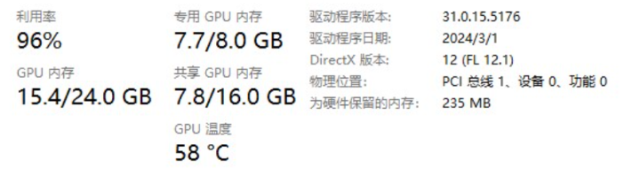

## 访问 `https:\\localhost:65530` 加载失败

A：如果你在 `Config.toml` 设置了 `tls = false` ，则需要将 https 改为 http，即访问 `http:\\localhost:65530`

## 为什么我在 config 里面把 tls=true 改成了 false，启动的时候还是把 tls 打开了？

A：如果设置了 ACME 的话，TLS 无论如何都是打开的。

## 在自己电脑上可以成功运行，在 autodl 上报错。

A：autodl 不支持 vulkan，无法使用。

## 为啥电脑有多张显卡时，跑 AI00 只有一张显卡在干活的感觉

A：AI00 暂时不支持多显卡推理。

## 报错： ERROR [ai00 server::middleware] reload model failed: failed to request adaptor

A：这是因为设备缺少 vulkan 驱动，请安装最新版本驱动。

## AI00 支持 CUDA 驱动吗?

A：不支持。AI00 目前支持 Vulkan 作为推理后端，曾支持 Dx12/openGL ，但不支持 CUDA 驱动。

## 为什么我使用共享显存后感觉速度变慢了

A：一旦用了共享显存，运行速度会慢 20 倍。这是计算机硬件的工作原理，并非 bug。

倘若大家遇到其他问题，欢迎加入 Ai00 QQ 交流群 30920262 提问。
