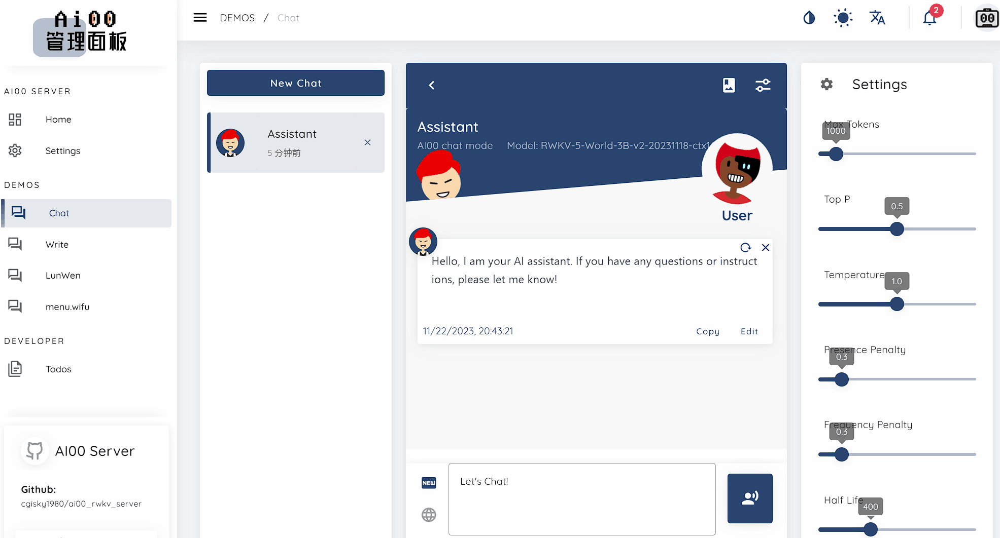
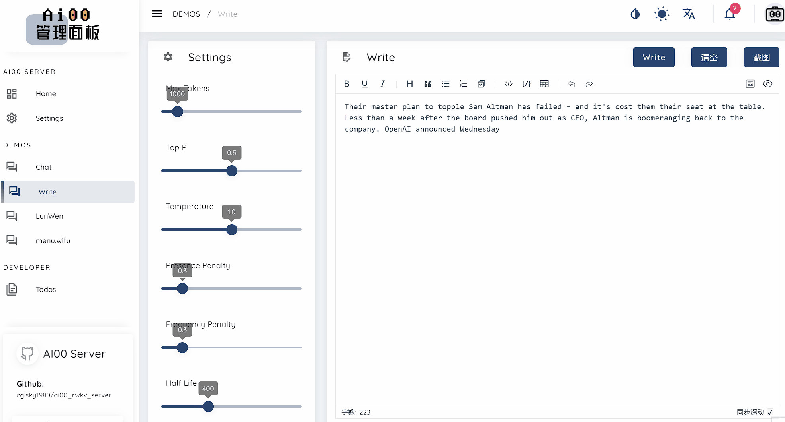
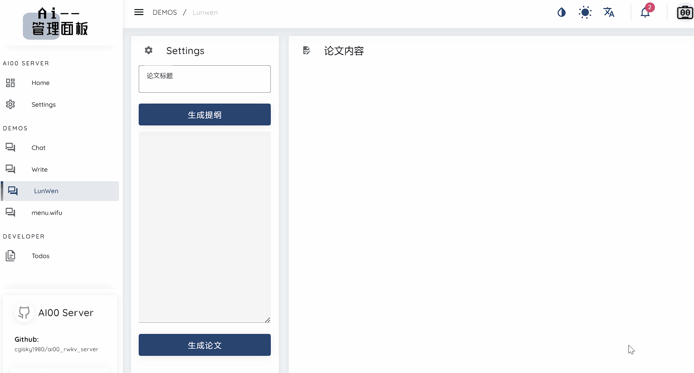

## 简介

Ai00 Server 是基于 web-rwkv 推理引擎的 RWKV 语言模型推理 API 服务器。它本身也是一个基于 MIT 协议的开源软件，由 RWKV 开源社区成员 [@cryscan](https://github.com/cryscan) 和[@顾真牛](https://github.com/cgisky1980)牵头成立的 Ai00-x 开发组开发。

Ai00 Server 支持 Vulkan/Dx12/openGL 作为推理后端，支持 Vulkan 并行和并发批量推理，可以在所有支持 Vulkan 的 GPU 上运行。事实上， Ai00 Server 支持大部分 NVIDIA、AMD、Intel 的显卡（包括集成显卡）。

在高兼容性的同时，Ai00 Server 又不需要笨重的 pytorch 、 CUDA 和其他运行时环境。它结构紧凑，开箱即用，且支持 INT8/NF4 量化，可以在绝大部分的个人电脑上高速运行。

Ai00 Server 仓库地址：<https://github.com/Ai00-X/ai00_server>

## ❓ AI00 怎么读

  >AI 读作 “AI” 或是 “爱”；00 读作 “零零” 或是 “蛋蛋”
  
#### 💡 AI = Artificial Intelligence = 人工智能
>
> AI = ài = 爱 = 愛 = любовь = love = あい = Liebe = aimer = Te amo = 애 = ...
>
>  **AI00** 的始点是爱!

#### 💋 00 = 无 = 天地之始（《道德经》）

>《道德经》中说:“无，名天地之始”；
> 
>《道德经》中又说:“万物之始，大道至简，衍化至繁。”;
>
> AI00 将从一片空白演化出一个自己的生态圈，00 代表着一切的基础。

**AI00t** 希望汇聚一群怀有无私、互惠等共同理念的有才之士，携手打造出一个伟大的体系。

## 功能预览

**聊天功能**

与模型对话，聊天或提出问题让模型回答。

**续写功能**

使 RWKV 模型根据你给定的内容进行续写。

也可以使用特定格式的 prompt 让模型遵循某种指令执行任务。具体的 prompt 实现请参阅：[Awesome-RWKV-Prompts](https://shoumenchougou.github.io/Awesome-RWKV-Prompts/#/Writer-Prompts) 

**写论文**

从给定的论文标题生成论文提纲，再根据提纲生成论文内容。

