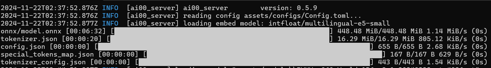

# Ai00 的 API 概览

以下是 Ai00 兼容 OpenAI 的 API 文档，本地启动 Ai00 后，可以通过 `http://localhost:65530/api-docs/` 打开 API 文档。

要查看调试和配置的 API 文档，请参考 [Debug API](./debug-api.md)。

## Ai00 的采样方法

Ai00 默认使用 Nucleus （又名 top_k ）采样方法，这也是 RWKV 模型的默认解码方式。但除了 Nucleus， Ai00 也额外支持 Mirostat 和 Typical 两种采样方式。

不同的采样方法有不同的解码参数，调整模型的各类解码参数，将会影响模型生成的内容风格、内容质量等指标。

以下是 Ai00 三种采样方式的简要描述，和对应的模型解码参数：

### Nucleus 采样

Nucleus （又名 top_k ）采样方法是通过累积概率（top_p）来选择模型生成的词汇，确保文本多样化且不偏离主题。

Nucleus 采样支持如下解码参数：

| 参数名称          | 类型    | 参数解释                                                                             |
| ----------------- | ------- | ------------------------------------------------------------------------------------ |
| frequency_penalty | number  | 存在惩罚，惩罚**已经出现过的**，减少它们再次出现的机会                               |
| penalty           | integer | 惩罚半衰期，模型在输出足够的字数后调整 penalty_decay，**不建议修改**                 |
| penalty_decay     | number  | 频率的衰减参数，在每一步生成中逐步减小惩罚值，范围 [0.99, 0.999]，**不建议修改**     |
| presence_penalty  | number  | 频率惩罚，惩罚**出现频率较高的词**，减少它们频繁出现的机会                           |
| temperature       | number  | 采样温度（可以理解为随机性），数值越大随机性越强、更具创造力，也可能导致上下文不连贯 |
| top_k             | integer | 模型生成内容时的候选词数量（类似于输入法的候选词数量）                               |
| top_p             | number  | 模型生成的累积概率，这个值越大生成的内容更多样化，但也更容易偏离对话主题甚至胡言乱语 |

在 Ai00 的 API 请求中，标准的 Nucleus 采样格式如下：

``` json
{
  "sampler_override": {
    "frequency_penalty": 0.3,
    "penalty": 400, 
    "penalty_decay": 0.99654026,
    "presence_penalty": 0.3,
    "temperature": 1,
    "top_k": 128,
    "top_p": 0.5,
    "type": "Nucleus"
  }
}
```

### Mirostat 采样

Mirostat 采样通过动态调整熵（随机性）来平衡创造性和连贯性。

| 参数名称 | 类型   | 参数解释                                                                                                  |
| -------- | ------ | --------------------------------------------------------------------------------------------------------- |
| Rate     | number | 模型调整随机性的速度，较高的 rate 值会让模型更快适应新的上下文，但可能导致回答的主题不连贯                |
| tau      | number | 模型生成文本时的目标随机性，较高的 tau 值会导致模型生成的文本更有创造性和多样性，但可能导致内容不太连贯。 |

在 Ai00 的 API 请求中，标准的 Mirostat 采样格式如下：

``` json
{
  "sampler_override": {
    "Rate": 0.09,
    "tau": 0.5,
    "type": "Mirostat"
  }
}
```

### Typical 采样

Typical 采样通过选择上下文中最有代表性的词，以避免极端概率导致的内容脱轨。

| 参数名称          | 类型    | 参数解释                                                                                                  |
| ----------------- | ------- | --------------------------------------------------------------------------------------------------------- |
| frequency_penalty | number  | 存在惩罚，惩罚**已经出现过的词**，减少它们再次出现的机会                                                  |
| penalty           | integer | 惩罚半衰期，模型在输出足够的字数后调整 penalty_decay，**不建议修改**                                      |
| penalty_decay     | number  | 频率的衰减参数，在每一步生成中逐步减小惩罚值，范围 [0.99, 0.999]，**不建议修改**                          |
| presence_penalty  | number  | 频率惩罚，惩罚**出现频率较高的词**，减少它们频繁出现的机会                                                |
| temperature       | number  | 采样温度（可以理解为随机性），数值越大随机性越强、更具创造力，也可能导致上下文不连贯                      |
| top_k             | integer | 模型生成内容时的候选词数量（类似于输入法的候选词数量）                                                    |
| tau               | number  | 模型生成文本时的目标随机性，较高的 tau 值会导致模型生成的文本更有创造性和多样性，但可能导致内容不太连贯。 |

在 Ai00 的 API 请求中，标准的 Typical 采样格式如下：

``` json
{
  "sampler_override": {
    "frequency_penalty": 0.3,
    "penalty": 400, 
    "penalty_decay": 0.99654026,
    "presence_penalty": 0.3,
    "temperature": 1,
    "top_k": 128,
    "tau": 5,
    "type": "Typical"
  }
}
```


## api/oai/chat/completions

**API 功能**：`api/oai/chat/completions` 和 `api/oai/v1/chat/completions` 是相同的 API ，用于 RWKV 的聊天续写模式，也就是和模型对话。

**API 地址**：（post）`http://localhost:65530/api/oai/chat/completions`

**参数列表**：


| 参数名称         | 是否可选 | 类型                     | 参数解释                                                                  |
| ---------------- | -------- | ------------------------ | ------------------------------------------------------------------------- |
| messages         | 必选     | array\<object\>          | 对话历史记录，每个对象包含 role(角色)和 content(内容)两个字段             |
| names            | 必选     | object\<Role, string\>   | 角色名称映射，可以自定义 system/user/assistant/observation 等角色的显示名 |
| state            | 可选     | string                   | 指定使用的 RWKV state 文件 UUID                                         |
| max_tokens       | 可选     | integer                  | 生成文本的最大 token 数                                  |
| stop             | 可选     | array\<string\>          | 停止词列表，当生成内容包含这些词时会停止生成，默认值为 ["\n\n"]           |
| stream           | 可选     | boolean                  | 是否以流模式生成文本，默认值为 false                                      |
| bias             | 可选     | object\<number, number\> | token id 到权重的映射，用于调整特定 token 的生成概率，默认为空            |
| bnf_schema       | 可选     | string \| null           | BNF 语法规则，用于约束模型输出格式，默认为 null                           |
| sampler          | 可选     | object                   | 默认的采样参数（Nucleus 类型）                                            |
| sampler_override | 可选     | Option\<SamplerParams\>  | 覆盖默认采样参数，可以选择不同的采样方法                                  |


因此，聊天续写 API 的请求主体参考如下：

``` json
{
  "max_tokens": 1000,
  "messages": [
    {
      "content": "Hi!",
      "role": "user"
    },
    {
      "content": "Hello, I am your AI assistant. If you have any questions or instructions, please let me know!",
      "role": "assistant"
    },
    {
      "content": "Tell me about water.",
      "role": "user"
    }
  ],
  "names": {
    "assistant": "Assistant",
    "user": "User"
  },
  "sampler_override": {
    "frequency_penalty": 0.3,
    "penalty": 400,
    "penalty_decay": 0.99654026,
    "presence_penalty": 0.3,
    "temperature": 1,
    "top_k": 128,
    "top_p": 0.5,
    "type": "Nucleus"
  },
  "state": "00000000-0000-0000-0000-000000000000",
  "stop": [
    "\n\nUser:"
  ],
  "stream": false
}
```

API 返回结果参考如下：

``` json
{
    "object": "chat.completion",
    "model": "assets/models\\RWKV-x060-World-1B6-v2.1-20240328-ctx4096.st",
    "choices": [
        {
            "message": {
                "role": "Assistant",
                "content": "Water is a liquid that is essential for life on Earth. It is a mixture of hydrogen and oxygen atoms, which makes it a highly reactive and polar molecule. Water has a high surface tension and is able to form water droplets when it comes into contact with other substances. It is found in various forms, including ice, snow, rain, and fog. Water is also essential for the growth and survival of plants and animals."
            },
            "index": 0,
            "finish_reason": "stop"
        }
    ],
    "usage": {
        "prompt": 41,
        "completion": 88,
        "total": 129,
        "duration": {
            "secs": 4,
            "nanos": 381959200
        }
    }
}
```
返回结果说明：

- `object`: 返回对象类型，固定为 "chat.completion"
- `model`: 当前使用的模型路径
- `choices`: 生成结果数组，包含以下字段：
  - `message`: 生成的消息对象，包含：
    - `role`: 角色类型，固定为 "Assistant"
    - `content`: 生成的文本内容
  - `index`: 结果的索引号
  - `finish_reason`: 生成停止的原因
- `usage`: 使用统计信息，包含以下字段：
  - `prompt`: 输入提示的 token 数量
  - `completion`: 生成内容的 token 数量
  - `total`: 总 token 数量
  - `duration`: 生成耗时，包含秒和纳秒

## api/oai/completions

**API 功能**：`api/oai/completions`和 `api/oai/v1/completions`是相同的续写 API，用于基础续写模式，让模型接着你的 prompt 继续生成内容。

**API 地址**：（post）`http://localhost:65530/api/oai/completions`

**参数列表**：

| 参数名称         | 是否可选 | 类型                    | 参数解释                                                       |
| ---------------- | -------- | ----------------------- | -------------------------------------------------------------- |
| prompt           | 必选     | Array\<String\>         | 你提供给模型的续写提示文本数组                                 |
| state            | 可选     | string                  | 指定使用的 RWKV state 文件 UUID                              |
| max_tokens       | 可选     | integer                 | 生成文本的最大 token 数，默认值为 256                          |
| stop             | 可选     | Array\<String\>         | 停止词列表,当生成内容包含这些词时会停止生成，默认值为 ["\n\n"] |
| stream           | 可选     | boolean                 | 是否以流模式生成文本，默认值为 false                           |
| bias             | 可选     | HashMap\<u16, f32\>     | token id 到权重的映射，用于调整特定 token 的生成概率，默认为空 |
| bnf_schema       | 可选     | Option\<String\>        | BNF 语法规则，用于约束模型输出格式，默认为 None                |
| sampler          | 可选     | NucleusParams           | 默认的 Nucleus 采样参数                                        |
| sampler_override | 可选     | Option\<SamplerParams\> | 覆盖默认采样参数，可以选择不同的采样方法                       |

参考的请求主体：

```json
{
    "prompt": [
        "The Eiffel Tower is located in the city of"
    ],
    "stop": [
        "\n\n",
        "."
    ],
    "stream": false,
    "max_tokens": 1000,
    "sampler_override": {
        "type": "Nucleus",
        "top_p": 0.5,
        "top_k": 128,
        "temperature": 1,
        "presence_penalty": 0.3,
        "frequency_penalty": 0.3,
        "penalty": 400,
        "penalty_decay": 0.99654026
    },
    "state": "00000000-0000-0000-0000-000000000000"
    }
```

API 返回结果参考如下：

```json
{
    "object": "text_completion",
    "model": "assets/models\\RWKV-x060-World-3B-v2.1-20240417-ctx4096.st",
    "choices": [
        {
            "text": " Paris, France",
            "index": 0,
            "finish_reason": "stop"
        }
    ],
    "usage": {
        "prompt": 11,
        "completion": 4,
        "total": 15,
        "duration": {
            "secs": 0,
            "nanos": 260801800
        }
    }
}
```

返回结果说明：
- `object`: 返回对象类型，固定为 "text_completion"
- `model`: 当前使用的模型路径
- `choices`: 生成结果数组，包含以下字段：
  - `text`: 生成的文本内容
  - `index`: 结果的索引号
  - `finish_reason`: 生成停止的原因
- `usage`: 使用统计信息，包含以下字段：
  - `prompt`: 输入提示的 token 数量
  - `completion`: 生成内容的 token 数量
  - `total`: 总 token 数量
  - `duration`: 生成耗时，包含秒和纳秒

## api/oai/chooses

**API 功能**：API 拥有 "input" 和 "choices" 参数，即给定输入和选项，让模型按照困惑度对选项进行排名，从而选出最合适的回答。

`api/oai/chooses` 和 `api/oai/v1/chooses` 是相同的 API。

**API 地址**：（post）`http://localhost:65530/api/oai/chooses`

**参数列表**：

| 参数名称 | 是否可选 | 类型            | 参数解释                          |
| -------- | -------- | --------------- | --------------------------------- |
| input    | 必选     | Array\<String\> | 提供给模型的输入文本数组          |
| choices  | 必选     | Array\<String\> | 供模型选择的选项数组              |
| state    | 可选     | string          | 指定使用的 RWKV state 文件 UUID |

该 API 请求主体参考如下：

```json
{
  "choices": [
    " Paris",
    " Seattle",
    " San Francisco",
    " Shanghai"
  ],
  "input": [
    "The Eiffel Tower is located in the city of"
  ],
  "state": "00000000-0000-0000-0000-000000000000"
}
```

API 返回结果参考如下：

```json
{
    "object": "list",
    "model": "assets/models\\RWKV-x060-World-3B-v2.1-20240417-ctx4096.st",
    "data": [
        {
            "object": "choice",
            "index": 0,
            "rank": 0,
            "choice": " Paris",
            "perplexity": 0.031040953
        },
        {
            "object": "choice",
            "index": 2,
            "rank": 1,
            "choice": " San Francisco",
            "perplexity": 6.299065
        },
        {
            "object": "choice",
            "index": 3,
            "rank": 2,
            "choice": " Shanghai",
            "perplexity": 12.735298
        },
        {
            "object": "choice",
            "index": 1,
            "rank": 3,
            "choice": " Seattle",
            "perplexity": 14.686427
        }
    ]
}
```

返回结果说明：

- `object`: 返回对象类型，固定为 "list"
- `model`: 当前使用的模型路径
- `data`: 选择结果数组，包含以下字段：
  - `object`: 选项类型，固定为 "choice"
  - `index`: 选项在原始 choices 数组中的索引
  - `rank`: 选项在排序后的排名（0 为最佳选择）
  - `choice`: 选项内容
  - `perplexity`: 困惑度分数，分数越低表示该选项越合适

## api/oai/embeddings

**API 功能**：`api/oai/embeddings` 和 `api/oai/v1/embeddings` 是相同的 API，使用当前加载的 RWKV 模型为给定文本生成嵌入向量，并指定生成嵌入向量的模型层数。

**API 地址**：（post）`http://localhost:65530/api/oai/embeddings`

**参数列表**：

| 参数名称 | 是否可选 | 类型                                      | 参数解释                       |
| -------- | -------- | ----------------------------------------- | ------------------------------ |
| input    | 是       | ( null \| string \| array&lt;string&gt; ) | 给嵌入模型的文本               |
| layer    | 是       | integer                                   | 指定生成嵌入向量的层数         |
| state    | 是       | string                                    | 指定使用的 RWKV state 文件路径 |

**参考的 API 请求主体**

``` json
{
  "input": "rwkv",
  "layer": 0,
  "state": "00000000-0000-0000-0000-000000000000"
}
```

**参考的 API 返回结果**

``` json
{
    "object": "list",
    "model": "assets/models\\RWKV-x060-World-1B6-v2.1-20240328-ctx4096.st",
    "data": [
        {
            "object": "embedding",
            "index": 0,
            "embedding":  [0.37109375, -0.015655518, -0.01977539, /* ... */]
        }
    ],
    "usage": {
        "prompt": 2,
        "completion": 1,
        "total": 3,
        "duration": {
            "secs": 0,
            "nanos": 2200
        }
    }
}
```

返回结果说明：

- `object`: 返回对象类型，固定为 "list"
- `model`: 当前使用的模型路径
- `data`: 嵌入向量结果数组，包含以下字段：
  - `object`: 嵌入对象类型，固定为 "embedding"
  - `index`: 结果的索引号
  - `embedding`: 生成的嵌入向量数组，包含多个浮点数
- `usage`: 使用统计信息，包含以下字段：
  - `prompt`: 输入提示的 token 数量
  - `completion`: 生成内容的 token 数量
  - `total`: 总 token 数量
  - `duration`: 生成耗时，包含秒和纳秒

## api/oai/embeds

**API 功能**：`api/oai/embeds` 和 `api/oai/v1/embeds` 是相同的 API，为给定文本生成嵌入向量，并指定生成嵌入向量的层数。

**注意**：该 API 是调用**第三方的嵌入模型**来生成嵌入向量，使用 API 前需打开 `\assets\configs\Config.toml` 配置文件，将最底部五行配置代码**取消注释**：

```
[embed] 
endpoint = "https://hf-mirror.com"
home = "assets/models/hf"
lib = "assets/ort/onnxruntime.dll" 
name = { MultilingualE5Small = {} }
```

保存配置文件，重启 Ai00 即可自动下载第三方模型。终端的下载过程如图：



模型下载完成后，即可使用该 API 。

**API 地址**：（post）`http://localhost:65530/api/oai/embeds`

**参数列表**：


| 参数名称   | 是否可选 | 类型    | 参数解释                                           |
| ---------- | -------- | ------- | -------------------------------------------------- |
| input      | 必选     | string  | 需要生成嵌入向量的文本                             |
| max_tokens | 可选     | integer | 文本分块的最大 token 数，范围 1-510，默认值为 510  |
| prefix     | 可选     | string  | 每个文本块的前缀，默认值为 "query:"                |


**参考的 API 请求主体**

``` json
{
  "input": "rwkv",
  "max_tokens": 510,
  "prefix": "query:"
}
```

**参考的 API 返回结果**

```json
{
    "object": "embeds",
    "model": "intfloat/multilingual-e5-small",
    "data": [
        {
            "object": "embed",
            "index": 0,
            "chunks": [
                {
                    "chunk": "第一个文本块",
                    "embed": [
                        [0.37109375, -0.015655518, -0.01977539, /* ... */]
                    ]
                },
                {
                    "chunk": "第二个文本块",
                    "embed": [
                        [0.20153809, 0.15637207, 0.24768066, /* ... */]
                    ]
                }
            ]
        }
    ]
}
```

返回结果说明：

- `object`: 返回对象类型，固定为 "embeds"
- `model`: 当前使用的嵌入模型
- `data`: 嵌入向量结果数组，包含以下字段：
  - `object`: 嵌入对象类型，固定为 "embed"
  - `index`: 结果的索引号
  - `chunks`: 嵌入向量分块数组，包含以下字段：
    - `chunk`: 文本块内容
    - `embed`: 生成的嵌入向量数组，包含多个浮点数


## api/oai/models

**API 功能**：`api/oai/models` 和 `api/oai/v1/models` 是相同的 API，用于获取当前加载的模型信息。

**API 地址**：（get）`http://localhost:65530/api/oai/models`

**参考的 API 返回结果**
```json
{
    "data": [
        {
            "object": "models",
            "id": "RWKV-x060-World-1B6-v2.1-20240328-ctx4096"
        }
    ]
}
```

返回结果说明：

- `data`: 模型结果数组，包含以下字段：
  - `object`: 模型对象类型，固定为 "models"
  - `id`: 模型的 id 名称
