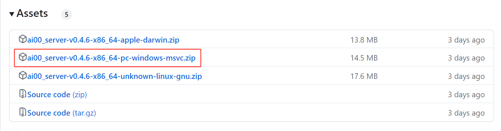
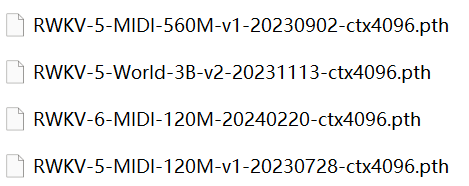
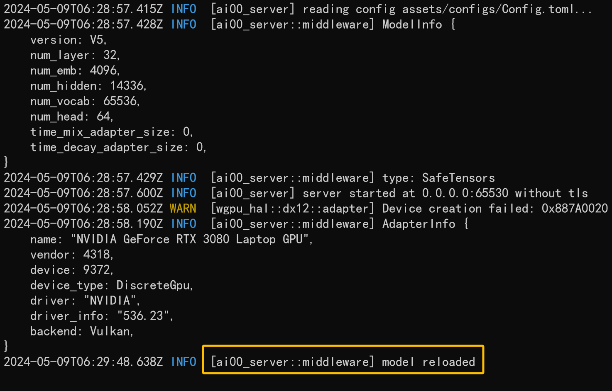

## 下载与安装

对于新手来说，我们建议直接从 Ai00 Server 的 [Release 页面](https://github.com/Ai00-X/ai00_server/releases)下载最新版本。

在每个版本发布的 Assets 版块可以找到已经打包好的 Ai00 Server 压缩包，下载并解压即可使用。



## 下载/转换 RWKV 模型

Ai00 Server 目前仅支持 `.st` 后缀的 Safetensors 模型，有两种方法可以得到 `.st` 模型：

1. **直接下载 `.st` 模型（推荐方式）**

从以下仓库中下载已经转换好的 `.st` 模型：

- [Hugging Face 仓库](https://huggingface.co/cgisky/ai00_rwkv_x060/tree/main)
- [Hugging Face 镜像站](https://hf-mirror.com/cgisky/ai00_rwkv_x060/tree/main)

2. **下载 `.pth` 后缀模型，并通过工具转换成 `.st` 模型**

从以下 RWKV 官方仓库中下载 `.pth` 后缀的 RWKV 模型：

- [Hugging Face 仓库](https://huggingface.co/BlinkDL/rwkv-6-world/tree/main)
- [Hugging Face 镜像站](https://hf-mirror.com/BlinkDL/rwkv-6-world/tree/main)

下载完成后，在文件夹中找到 `.pth` 模型:



在 Ai00 Server 解压的文件夹中，可以找到名为 “`convert.exe`” 的模型转换工具。

在 Ai00 目录启动终端并执行以下命令，可以将指定路径的 `.pth` 模型转化成 `.st` 模型：

```
$ ./converter --input /path/to/model.pth
```
请将上述命令中的 `/path/to/model.pth` 改成需要转换的模型文件路径。

获得 `.st` 后缀的 RWKV 模型后，我们需要在 `assets` 文件夹中新建一个 `models` 文件夹，并将 RWKV 模型放在此文件夹中。

## Ai00 的显存需求

以下是 Ai00 不同量化方式的显存需求：

<Callout type="info" emoji="ℹ️">
测试环境：

- CPU ：i7-10870H
- GPU： RTX 4090 ，24G 显存
- 内存：32GB
</Callout>

| 量化方式 | 1B6 模型 | 3B 模型 | 7B 模型 | 14B 模型 |
| --- | --- | --- | --- | --- |
| FP16 | 3.2GB 显存 | 6.5GB 显存 | 14.4GB 显存 | 约 29G 显存 |
| INT8 | 2GB 显存 | 4.4GB 显存 | 8.2GB 显存 | 14.8GB 显存 |
| NF4 | 1.3GB 显存 | 2.6GB 显存 | 5.2GB 显存 | 10.4GB 显存 |


## 调整配置参数

Ai00 程序会按照 `assets/configs/Config.toml` 配置文件中的参数启动服务并运行 `RWKV` 模型。可以通过文本编辑软件（如记事本等）修改 `Config.toml` 的配置项，调整模型的运行效果。

下面是一组推荐的 `Config.toml` 配置。

**注意：** 除非你了解其具体作用，否则不要随意改动带有 `【不建议更改】` 标注的配置项。

``` bash copy
[model]
embed_device = "Cpu"                                 # 在 GPU 还是 CPU 上放置模型的 Embed 矩阵
max_batch = 8                                        # 【不建议更改】GPU 上缓存的最大批次
name = "RWKV-x060-World-3B-v2.1-20240417-ctx4096.st" # 模型名称，只支持后缀 .st 格式模型，请下载转换好的模型或自行转换
path = "assets/models"                               # 模型存放的路径
precision = "Fp16"                                   # 【不建议更改】中间张量精度 ("Fp16" or "Fp32")，Fp32 精度更高但速度更慢
quant = 0                                            # 量化层数，调高会提升效率，但可能损失精度，使模型效果变差
quant_type = "Int8"                                  # 量化类型 ("Int8" 或 "NF4")，Int 8 效果比 NF4 好，但需要更多显存
stop = ["\n\n"]                                      # 【不建议更改】添加额外的生成停止词
token_chunk_size = 128                               # 并行 Token 块大小，范围 32-128，显卡越牛逼这个数调越大（64 或 128）

# [[state]] # 是否挂载 state 文件
# id = "fd7a60ed-7807-449f-8256-bccae3246222"   #  state 文件的 UUID，不指定则随机分配 
# name = "x060-3B" # 是否为此 state 文件命名（可选项），可填 null
# path = "rwkv-x060-chn_single_round_qa-3B-20240505-ctx1024.state" # state 文件的路径，存放于 assets/models 目录下可填文件名称

# [[state]] # 继续挂载多个 state 文件
# id = "6a9c60a4-0f4c-40b1-a31f-987f73e20315"    # state 文件的 UUID，不指定则随机分配 
# name = "x060-7B" # 是否为此 state 文件命名（可选项），可填 null
# path = "rwkv-x060-chn_single_round_qa-3B-20240502-ctx1024.state" # 第二个 state 文件的路径，存放于 assets/models 目录下可填文件名称

# [[lora]] # 是否默认挂载 LoRA 文件
# alpha = 192 # LoRA 文件的 alpha 值
# path = "assets/models/rwkv-x060-3b.lora" # LoRA 文件的路径

[tokenizer]
path = "assets/tokenizer/rwkv_vocab_v20230424.json" # 【不建议更改】分词器路径

[bnf]
enable_bytes_cache = true   # 【不建议更改】是否启用缓存机制，以加速 BNF 某些短模式（schemas）的展开过程。
start_nonterminal = "start" # 【不建议更改】指定 BNF 模式中的初始非终结符。

[adapter]
Auto = {} # 【不建议更改】自动选择最佳 GPU。
# Manual = 0 # 手动指定使用哪个 GPU，可以通过 API （get）http://localhost:65530/api/adapters 获取可用的 GPU 列表

[listen]
acme = false # 【不建议更改】是否启用 acme 证书
domain = "local" # 【不建议更改】Ai00 服务域名
ip = "0.0.0.0"   # IPv4 地址
# ip = "::"        # 使用 IPv6
force_pass = true  # 是否强制通过鉴权步骤，改成 false 以使用密钥鉴权，从而控制 admin 系列 API 的访问权限
port = 65530 # Ai00 服务端口
slot = "permisionkey" 
tls = false  # 是否使用 https ，如果你只在本地体验 AI00 ，建议设置为 false

[[listen.app_keys]] # 添加多个用于管理员鉴权的密钥
app_id = "admin"
secret_key = "ai00_is_good"

[web] # 【不建议更改】移除此项以禁用 WebUI
path = "assets/www/index.zip" # 【不建议更改】web 界面资源的路径

# 【不建议更改】启用第三方的嵌入模型（使用 fast-embedding onnx 模型）
# 使用 API（post）http://localhost:65530/api/oai/embeds 可以调用第三方嵌入模型进行 embedding 操作
# [embed] # 取消 [embed] 及以下注释，启用第三方嵌入模型
# endpoint = "https://hf-mirror.com" # 第三方嵌入模型来源
# home = "assets/models/hf" # 第三方嵌入模型存放路径
# lib = "assets/ort/onnxruntime.dll"  # 仅在 windows 下使用
# name = { MultilingualE5Small = {} } # 第三方嵌入模型的名称
```

## 运行 Ai00 程序

配置项修改完毕后，请保存 `Config.toml` 文件，并双击运行 `ai00_server.exe` 程序。

当命令行中出现 `INFO  [ai00_server::middleware] model loaded` 提示时，意味着模型已经加载完成：



此时我们打开任意浏览器，并访问 `https://localhost:65530`，即可打开 Ai00 的 Web 界面。


## 调整右侧解码参数

Web 页面的右侧有一些可设置的模型解码参数，如 `Temperature` 、`Top_P`、`Presence Penalty` 和 `Frequency Penalty` ，调整这些参数会影响模型的生成效果。

参数对应的效果如下：

| API 参数| 效果描述  |
|----|----|
| Temperature | 采样温度，就像给模型喝酒，数值越大随机性越强，更具创造力，数值越小则越保守稳定。                                             |
| Top_P | 就像给模型喂镇静剂，优先考虑前 n% 概率质量的结果。如设置成 0.1 则考虑前 10%，生成内容质量更高但更保守。如设置成 1，则考虑所有质量结果，质量降低但更多样。 |
| Presence Penalty | 存在惩罚，正值根据“新 token 在至今的文本中是否出现过”来对其进行惩罚，从而增加了模型涉及新话题的可能性。|
| Frequency Penalty| 频率惩罚，正值根据“新 token 在至今的文本中出现的频率/次数”来对其进行惩罚，从而减少模型原封不动地重复相同句子的可能性。|

其中 `Temperature` 和 `Top_P` 两个参数对模型生成效果的影响最大。

### 参数推荐

续写小说和对话这一类需要创造性的任务，需要高 `Temperature` + 低 `Top_P` 的参数组合，可以尝试以下四种参数搭配：

`Temperature` 1.2 ，`Top_P` 0.5

`Temperature` 1.4 ，`Top_P` 0.4

`Temperature` 1.4 ，`Top_P` 0.3

`Temperature` 2 ，`Top_P` 0.2

举个例子，续写小说可以尝试将 `Temperature` 设为 2 （ `Temperature` 增加会提高文采，但逻辑会下降），然后将 `Top_P` 设为 0.1 ~ 0.2 （`Top_P` 越低，逻辑能力越强），这样生成的小说内容逻辑和文采都很好。
完成相对机械的任务，例如材料问答、文章摘要等，则可将参数设为：

`Temperature` 1 ，`Top_P` 0.2

`Temperature` 1 ，`Top_P` 0.1

`Temperature` 1 ，`Top_P` 0

举个例子，如果你正在执行像关键词提取之类的机械任务，不需要模型进行任何开放性思考，则可以将 `Temperature` 设为 1 ，`Top_P`、`Presence Penalty`、`Frequency Penalty` 都设为 0 。
