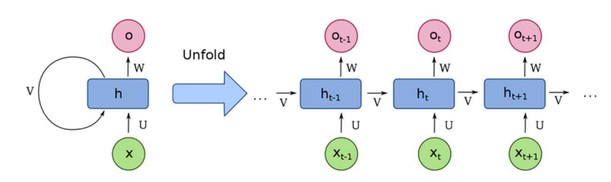
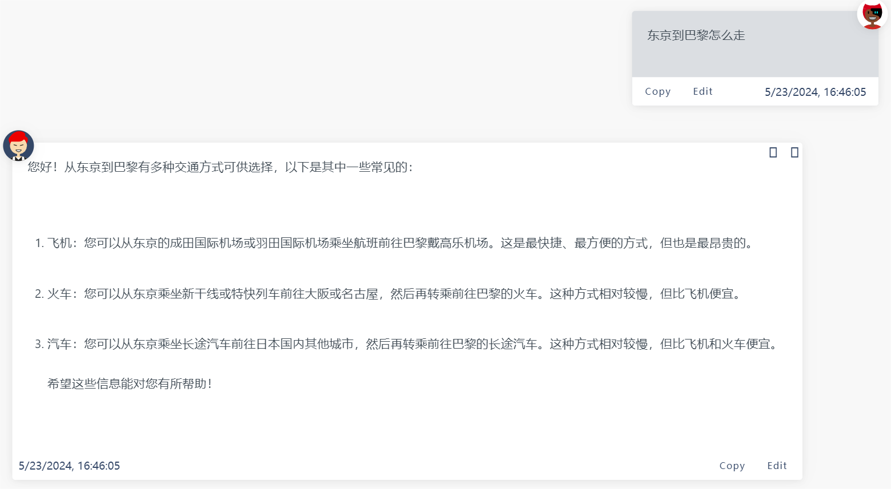
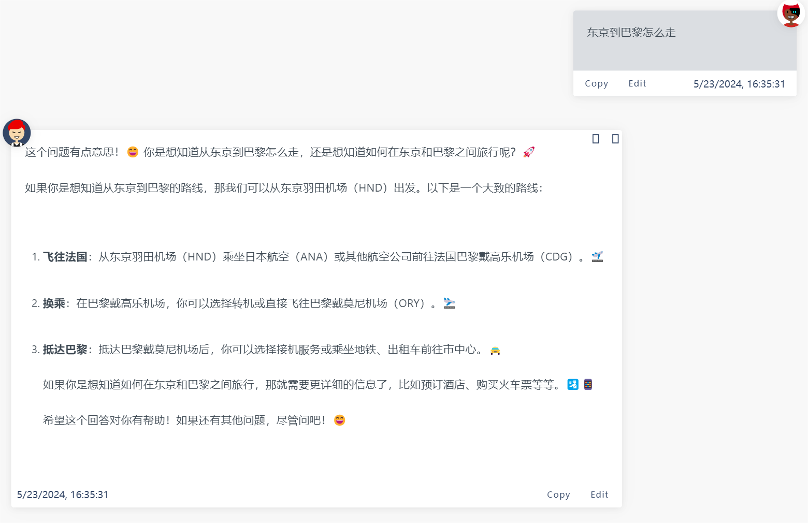
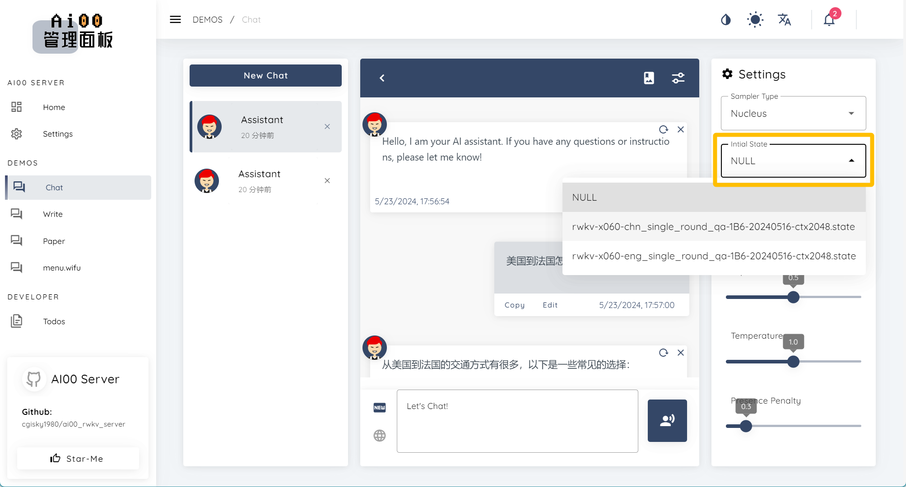

# 初始State

## RNN 架构和隐藏状态

循环神经网络（RNN）是一种广泛应用于深度学习领域的神经网络模型，RWKV 是 RNN 的一种变体。

RNN 网络在运行过程中会保持一个隐藏状态（state），隐藏状态可看作 RNN 模型的“心理状态”。就像人类在思考时，脑海中会保留与当前事件关联度最高的“关键信息”。随着思考内容的变化，我们脑海中的“关键信息”会不断更新。同样的，RNN 网络也会**通过特定的函数不断更新其隐藏状态**。



如图所示，RNN 网络依次处理每一个输入的 token，并根据“当前隐藏状态”来预测下一个可能出现的 token（如果有需求）。每处理一个 token，RNN 会将结果反馈给网络自身，从而“更新其隐藏状态”，再用“更新后的状态”去预测下一个 token。如此循环，直到达到“完成任务”的状态。


作为 RNN 的一种变体，RWKV 支持对隐藏状态进行微调（[state tuning](https://rwkv.cn/tutorials/advanced/Fine-Tune/RWKV-PEFT/State-Tuning)）。通过调整模型的“心理状态”，可使 RWKV 模型在特定任务上表现更佳。

## 初始化 RWKV state

在 Ai00 中挂载 State 文件，可以初始化 RWKV 模型的初始状态，以强化模型在某一类任务的表现。

以一个强化单轮问答 + emoji 表情的 State 为例，同样都是“东京到巴黎怎么走”这个问题，模型在挂载该 State 前后的回答画风完全不同：

**不挂载 State 文件：**



**挂载“强化单轮中文对话 + emoji ”的 State 文件后：**



## 下载 State 文件

Ai00 Server 目前仅支持 `.state` 后缀的 State 文件，可以从 [HF 仓库](https://huggingface.co/cgisky/ai00_rwkv_x060/tree/main)下载 `.state` 文件。

如果你无法访问上面的网站，请访问 [HF 镜像站](https://hf-mirror.com/cgisky/ai00_rwkv_x060/tree/main)。

## 如何挂载 State ？

在 `Config.toml` 配置文件中修改关于挂载 State 的参数：

``` bash copy
# [[state]] # 是否挂载 state
# id = "fd7a60ed-7807-449f-8256-bccae3246222"   #  state 文件的 UUID，不指定则随机分配 
# name = "x060-3B" # 是否为此 state 文件命名（可选项）
# path = "rwkv-x060-chn_single_round_qa-3B-20240505-ctx1024.state" # state 文件的路径
```
要启用 State 挂载功能，请移除 `#` 注释符号，并修改对应的参数。参考如下：

``` bash copy
[[state]] # 是否挂载 state
# id = "fd7a60ed-7807-449f-8256-bccae3246222"   # 非开发环境一般不指定 UUID，可保留 `#` 注释符
name = "x060-7B-Chinese"  # 为此 state 文件命名为“x060-7B-Chinese”
path = "rwkv-x060-chn_single_round_qa-7B-20240516-ctx2048.state" # state 文件的名称，存放在 `model` 文件夹
```

## 挂载 State 注意事项


> **注意：** 挂载 state 文件时，必须使用与 State 文件参数一致的基底 RWKV 模型。


举个例子：这个 State 文件是基于 `RWKV-6-World-7B` 模型微调而来，那么你在 Ai00 中必须启动 `RWKV-6-World-7B` 模型，挂载的 State 文件才会生效。


截至 Ai00 0.5.0 版本，支持在 WebUI-聊天模式右上方动态切换 State，但不支持同时挂载多个 State 。



## RWKV state 文件命名规范

RWKV 官方 state 文件通常有两种命名规则：

- rwkv6-world-v3-7b-chn_文言文QA-20241114-ctx2048.pth
- rwkv-x060-OnlyForChnNovel_小说扩写-14B-20240806-ctx4096.pth

让我们逐一解析每个字段的含义：

| 字段 | 含义 |
| --- | --- |
| **rwkv6/rwkv-x060** | 模型架构版本号 |
| **world** | 模型类型，World 指使用全球语言数据集训练的 RWKV 模型，因此支持多语言任务 |
| **v3** | 模型的训练集版本 |
| **7b/14b** | 模型参数量 |
| **chn_文言文QA/OnlyForChnNovel_小说扩写** | state 的用途，通常是用于强化模型在特定任务上的表现 |
| **20241114/20240806** | state 的发布日期 |
| **ctx2048/ctx4096** | state 支持的上下文长度 |

在为 RWKV state 文件命名时，**架构版本号**、**模型类型**、**参数量** 和 **state 用途**是必须的。示例命名： `RWKV-6-World-3B-v2.1-chn_文言文QA`。

 RWKV state 文件**要配合对应的 RWKV 模型才能正常使用**。在 state 文件命名中保留以上信息，可以方便用户快速识别 state 文件适用的 RWKV 模型。
